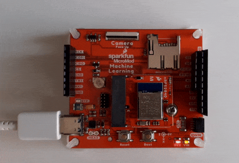

## SIMPLE BLINK EXAMPLE

Blinkenlight with embedded Rust :) 
Ported to Sparkfun MicroMod nRF52840 board (https://www.sparkfun.com/products/16984).  In order to flash code with nrfutil, Adafruit bootloader has to be flashed onto the board first. 



### BOOTLOADER:

Adafruit provides a pre-built bootloader for this board (https://github.com/adafruit/Adafruit_nRF52_Bootloader/releases)

With the board connected to one of the carrier boards, e.g. the [Machine Learning Carrier Board](https://www.sparkfun.com/products/16400), connect JLink to the SWD pins. Using JLinkExe connect to the board, selecting NRF52840 as the target MCU and SWD as connection protocol. When connected:

* `erase`
* `loadbin sparkfun_nrf52840_micromod_bootloader-0.6.0_s140_6.1.1.hex, 0x0`
* `r` to reset

### HOW TO FLASH:

* build the code: ```cargo build --release```
* convert to .hex file: ```arm-none-eabi-objcopy -O ihex target/thumbv7em-none-eabihf/release/blinky blinky.hex```
* create a dfu package: ```adafruit-nrfutil dfu genpkg --dev-type 0x0052 --application blinky.hex blinky.zip```
* put the board into bootloader mode (double click on reset button, will show up as _SFMM852BOOT_ 
* flash the firmware: ```adafruit-nrfutil dfu serial --package blinky.zip -p /dev/ttyACM0 -b 115200```
